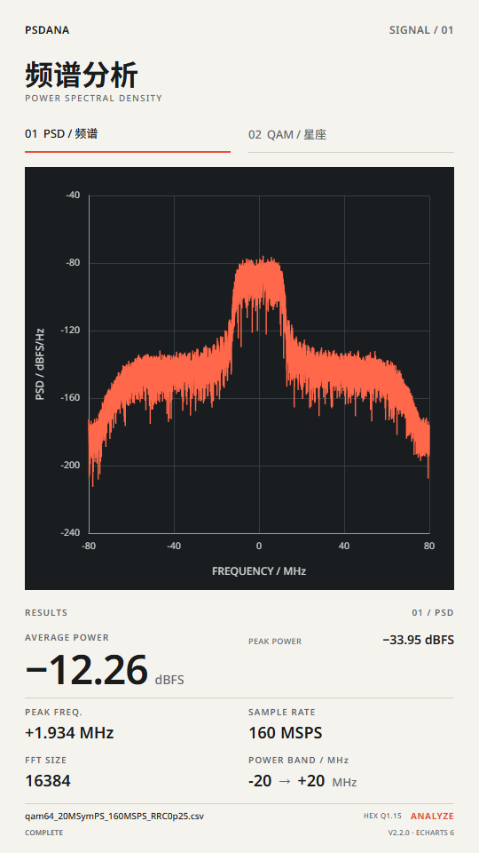
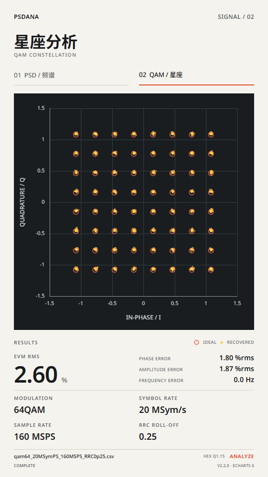

# PSDANA V2.2.0 WebUI Demo 实现与验收报告

日期：2026-10-09。基线：`d4957a4018331388f40587b322e63a46ff2c004d`（V2.1.2）；开发前核对 GitHub HEAD 与本地一致。

## 1. 交付结论

**PASS：真实本地 CSV → multipart → Go csvio/PSD/Power/QAM → JSON → ECharts 6 链路可运行。**
新增 `cmd/webdemo`，使用 net/http 与 embed，单 Go 进程提供 UI 和 API。
HTML/CSS/原生 JavaScript；运行不需要 Python、Node、CDN、数据库或 CLI 子进程。
Go 原算法、CSV reader、CLI、Golden 文件均未修改。本版本包含 POWER BAND 相等边界的单点频率测量修正，发布 tag / GitHub Release 为 V2.2.0。
V2.1.2 tag 指向原基线提交 `d4957a4018331388f40587b322e63a46ff2c004d`。

## 2. 本地启动与使用

在仓库根目录执行：

```shell
go -C go run ./cmd/webdemo
```

访问 <http://127.0.0.1:8080>。仅绑定本机 IPv4 回环地址；端口占用时先停止占用服务。
前台运行按 Ctrl+C 停止。也可 `go -C go build -o bin/webdemo ./cmd/webdemo` 后运行可执行文件；
静态资源内嵌，运行时不依赖工作目录。第一次构建需要现有 Go 工具链及 Gonum module 缓存/下载。

1. 全页面拖入 CSV，或点击底部文件名选择文件。
2. 点击参数值原位编辑；Enter 确认、Escape 取消，失去焦点提交。
3. 检查参数有效后点击 ANALYZE。切换 Tab 不再次上传。
4. 修改参数将旧结果标为 STALE；更换文件立即清除旧结果。

## 3. 实现范围与文件

| 新增文件/目录 | 职责 |
|---|---|
| `go/cmd/webdemo/main.go` | 固定回环地址、嵌入静态资源、路由、HTTP 基础头与超时 |
| `go/cmd/webdemo/handlers.go` | 有界 multipart、参数验证、直接调用 csvio/psd/qam、PARTIAL/ERROR |
| `go/cmd/webdemo/handlers_test.go` | Handler 边界、真实文件及 CLI 全字段比较 |
| `static/index.html` | 可访问的导航、单图表、Results、文件/状态区域 |
| `static/css/{tokens,layout,components,fonts}.css` | Figma tokens、统一 rem 布局、原位编辑、字体 |
| `static/js/main.js` | 初始化、显示映射、Tab、拖入、请求连接 |
| `static/js/{api,state,parameters,responsive}.js` | HTTP、结果版本管理、参数编辑/校验、统一缩放 |
| `static/js/charts/{common,psd,qam}.js` | 真实 PSD line 与 QAM scatter 映射 |
| `static/assets/` | 本地 Noto 字体、字体许可、原始 Figma 图例 SVG |
| `static/vendor/` | ECharts 6.0.0、LICENSE、NOTICE、资源来源记录 |
| `tools/webdemo/` | 开发用 Playwright 验收、数据映射测试及依赖说明 |
| `go/reports/v2.2.0/` | 本报告、JSON、截图、测试输出、资源校验记录 |

表中 `static/` 相对 `go/cmd/webdemo/`。修改的既有文件仅 `README.md`、`go/README.md`、`go/API.md`。
任务开始有未跟踪的 `web/design.md`；本次只读取，未写入或删除。工作期间再次检查时该文件已不在工作区；未恢复或干预该外部变化。

## 4. HTTP 契约

`GET /`：WebUI；`GET /api/health`：版本/健康；`POST /api/analyze`：multipart。
字段为 file、sample_rate_hz、power_band_left_hz、power_band_right_hz、symbol_rate_hz、rrc_beta。
固定 hex_q15、64QAM、FFT all、Legacy；其他配置复用原 DefaultConfig。
频率边界允许 `-Fs/2 <= lower <= upper <= Fs/2`；相等时调用原 Go 单点测量，倒置或超 Nyquist 仍报错。

完整请求限制 16 MiB，前端文件上限预留 64 KiB multipart 开销；只接受单文件。
并发计算入口为 1，忙时返回 503；临时 multipart 文件和流请求后释放，不提供本地文件路径接口。
200 COMPLETE：PSD/QAM 成功；200 PARTIAL：PSD 有效、qam_error、无 qam_metrics。
400：输入/参数错误；413：请求过大；422：PSD/Power 失败；403：跨 Origin；500：编码错误。

JSON 保持现有顶层 PSD 字段、power_metrics、qam_metrics，新增 status、rrc_beta、可选 qam_error。
实际频段从 power_metrics.freq_left_hz/freq_right_hz 可追溯，实际 RRC β 从响应返回。
PSD 的 null dB 点保留为空缺；不映射为 0 dB。零功率显示 −∞，空峰值频率和 null CFO 显示 N/A。
Phase Error 显示 phase_error_pct_rms。详见 [HTTP API](../../API.md#webui-http-adapterv220)。

## 5. 真实文件计算与一致性

同配置 HTTP 与未修改 CLI 的全部既有 JSON 字段使用深度相等比较，包含完整频率/PSD/星座数组和诊断，
不只比较舍入后的 UI 数字。没有为测试重写 DSP 方程或修改 Golden。

| 项目 | 64QAM 真实捕获 | +40 MHz 单音 |
|---|---:|---:|
| 输入文件 | qam64_20MSymPS_160MSPS_RRC0p25.csv | sine_+40MHz_160MSPS.csv |
| Fs | 160 MSPS | 160 MSPS |
| FFT all 实际点数 | 16384 | 8192 |
| 功率频段 | −20～20 MHz | 39～41 MHz |
| 平均功率 dBFS | −12.256841716009006 | −9.087628043990975 |
| 峰值 RBW bin 功率 dBFS | −33.954722044690875 | −9.087628043990962 |
| 频段内峰值频率 Hz | 1933593.75 | 40000000 |
| EVM % RMS | 2.5961906802351518 | 不提供，QAM 拒绝 |
| Phase Error % RMS | 1.8031193513575419 | 不提供 |
| Amplitude Error % RMS | 1.8678775797411906 | 不提供 |
| Frequency Error Hz | 0 | 不提供 |
| HTTP 状态 | COMPLETE | PARTIAL |
| HTTP/CLI 字段相等 | 24/24 | 23/23（PSD/Power CLI） |

64QAM 使用 20 MSym/s、β=0.25、Legacy。单音 CLI 对比不启用 QAM，因为原 CLI 的 QAM 失败即报错退出；
HTTP 则独立验证保留 PSD 的 PARTIAL 语义。
原始结果：[QAM HTTP JSON](qam-http.json)、[单音 HTTP JSON](sine-http.json)、[比较日志](http-tests.txt)。

### 单点频率修正（纳入 V2.2.0）

前端和 HTTP 层原先额外拒绝相等边界，现改为仅拒绝 lower>upper，直接复用 AnalyzeBandPower。
使用真实单音 CSV 配置 40→40 MHz：`is_point=true`，`contributing_bins=1`，峰值频率 40 MHz，
Average Power 与 Peak Power 均为 −9.087628043990962 dBFS。HTTP 与 CLI 全部 23 个既有字段完全一致；没有在前端重新积分或估算。
额外验证 DC、±Nyquist 相等边界、40.005 MHz 最近 bin、+Nyquist 单点及倒置边界拒绝。
浏览器验证相等边界可点击 ANALYZE，真实上传返回 PARTIAL（单音 QAM 拒绝），并显示单点功率。
[单点 JSON](sine-point-http.json) · [40 MHz 单点截图](sine-point-40MHz.png)。

## 6. Figma 视觉基准与截图

通过 Figma MCP 获取当前 [PSD Frame 4:28](https://www.figma.com/design/dAMCnMXgfY8clmRMgLPWyS/0120005_charts_demo?node-id=4-28)
和 [QAM Frame 4:29](https://www.figma.com/design/dAMCnMXgfY8clmRMgLPWyS/0120005_charts_demo?node-id=4-29) 的完整代码上下文、字体/颜色/位置及截图。
归档：[Figma PSD](figma-psd.png)、[Figma QAM](figma-qam.png)。未使用早期本地设计覆盖当前 Frame。

基准 540×960；主背景 #f5f3ee；边距 28；标题 y=64；Tabs y=130；图表 x=28/y=188/w=484/h=476；
Results y=682/h=210。Noto Sans / Noto Sans SC 已本地打包。
Footer 改为紧凑文件行与状态行（y=904 起），保留图表/Results 原尺寸和主指标字号。
原图例 SVG 在 Results 原位置显示；设计中的 Mock 数据曲线/星座 SVG 按用户要求替换为 ECharts 真实数据。
因此波形、纵轴范围、星座散布与结果数值和 Figma Mock 不同，这是实际测量输入的结果。





统一 rem 缩放：`min(viewportWidth/540, viewportHeight/960, 2160/960)`。
没有 CSS transform 或分别拉伸 X/Y；图表按实际 CSS 尺寸 resize/rebuild。
一个 ECharts 实例，Tab 切换 notMerge，QAM grid 宽高相等、I/Q 数值范围相同。
视口外留白继承相同背景，无外框、阴影或桌面装饰。

| 视口 CSS px | 内容 CSS px | PSD / QAM 截图 | 验收 |
|---|---|---|---|
| 540×960 | 540×960 | [PSD](psd-540x960.png) / [QAM](qam-540x960.png) | PASS |
| 1080×1920 | 1080×1920 | [PSD](psd-1080x1920.png) / [QAM](qam-1080x1920.png) | PASS |
| 1920×1080 | 607.5×1080 | [PSD](psd-1920x1080.png) / [QAM](qam-1920x1080.png) | PASS |
| 2560×1440 | 810×1440 | [PSD](psd-2560x1440.png) / [QAM](qam-2560x1440.png) | PASS |
| 3840×2160 | 1215×2160 | [PSD](psd-3840x2160.png) / [QAM](qam-3840x2160.png) | PASS |
| 390×844 | 390×693.333… | [PSD](psd-390x844.png) / [QAM](qam-390x844.png) | PASS |
| 2560×3000 | 1215×2160 | [PSD](psd-2560x3000.png) / [QAM](qam-2560x3000.png) | PASS |

自动断言几何容差 0.1 CSS px，中心位置、最大高度、无横向溢出、外框/阴影为零、背景色与图例实际尺寸均通过。
逐视口截图已目视检查，与本次最新 Figma 截图核对布局；这是视觉/几何验收，不是逐像素相同的宣称。

## 7. UI 与自动化验证

Chrome + Playwright、本地真实 Go 服务；16 组浏览器验收全部 PASS，页面 JavaScript error 列表为空。

- 全页面 dragenter/drop Overlay，真实 CSV File/DataTransfer，放下只选文件、不发请求。
- 点击文件区域触发 filechooser；文件替换清空图表；长 basename 省略且 title 完整。
- ANALYZE 上传真实文件；PSD/QAM 指标和 JSON 对应；Tab 切换无重复请求。
- Enter 提交、Escape 取消、Hover 提示、Idle 无框/背景、键盘可见焦点、箭头切换 Tab。
- 共享采样率、功率上下界独立编辑、修改后 Stale；Nyquist/SPS/β 错误禁止 ANALYZE。
- 移动端与 2 倍缩放时点击、编辑、Hover 坐标正确；DPR=2 时 540×960 CSS 布局保持不变。
- 单点 40→40 MHz 启用 ANALYZE、返回一个 bin 的 RBW 功率；倒置边界仍禁止分析。
- 单音 PARTIAL 后 QAM series 为空，不残留上一次星座。
- 真实非法 CSV ERROR、可重试并成功；传输失败后可重试。
- PROCESSING 禁止重复提交；延迟交付一个**真实服务器响应**，替换文件后旧响应不能覆盖新状态。
- null PSD 点保持 gap，实际频率数组顺序不变；无 QAM 结果时两个 Scatter 都为空。

[浏览器结构化记录](browser-validation.json) · [数据映射测试](mapping-tests.txt)

复现（先另开终端启动 Go 服务）：

```shell
cd tools/webdemo
npm install
npm test
```

使用已安装 Chrome；可通过环境变量 PSDANA_BROWSER=msedge 选择 Edge，PSDANA_URL 修改测试目标。
本次验证使用主机已安装的 Playwright 1.62.1，无需将 Node 加入 Demo 运行依赖。

## 8. Go 回归

- `go -C go test ./...`：PASS，包含原 csvio、psd、qam、integration/Golden 测试。
- `go -C go vet ./...`：PASS，无诊断。
- 新增 HTTP 测试：正常真实分析、空/缺文件、float/decimal negative/packed/bad hex、PSD 短输入失败、
  NaN/Inf、速率/SPS/β/频段/缺参数/固定格式、实数和短 IQ PARTIAL、Nyquist 端点、
  已知及未知 Content-Length 超限、跨 Origin、健康/静态页、busy、零功率 null、CLI 兼容；
  新增单点 DC/±Nyquist、真实 40 MHz/非 bin 对齐/+Nyquist 全字段 HTTP/CLI 比较。
- `go build ./cmd/webdemo`：PASS；`git diff --check`：PASS。

[Go 测试日志](go-test.txt) · [Vet 日志（空为无诊断）](go-vet.txt) · [HTTP 测试日志](http-tests.txt)

## 9. 已知限制与证据边界

1. 本地同步 Demo，同一时间一个分析，忙时返回 503。大文件或难分解 FFT 可较慢；没有性能优化或实时保证。
2. 请求取消不硬中断已有 DSP 调用，仅在阶段边界检查；前端保证丢弃旧响应，随后立即重试可能短暂遇到 busy。
3. 只解析 hex_q15。纯数字字符串也可合法表示十六进制，无法自动判断发送者原意为 decimal；不做格式猜测。
4. 无表头两列保持原 csvio 的歧义拒绝；推荐明确 I/Q 表头。单列 real 可分析 PSD，但无 QAM。
5. QAM 沿用原有 blind decision-directed Legacy 模型；低 EVM 或 COMPLETE 不是绝对锁定/硬件物理 EVM 认证。
6. 验证覆盖桌面 Chrome 的 CSS 视口和 DPR 仿真，未执行真实手机 Safari/触屏/OS 文件拖拽人工验收。
   自动拖放使用浏览器 File/DataTransfer，系统文件选择入口已验证可触发。
7. 状态/警告区域为固定高度，长文本省略、悬停显示完整信息；保持页面尺寸不跳动。
8. 仅本机 8080，无远程部署、身份体系或批处理队列。V2.2.0 Release 提供 Windows x64 Demo 包；其他系统可从源码构建。

## 10. V2.3.0 待办

原性能计划整体后移：FFT workspace/plan/buffer 复用、CSV 分配、内存使用、
大质因子 FFT 性能分析、Benchmark/Profiling，以及由实测驱动的后续优化。
本版未修改这些算法或实施优化；未来更改需重新验证 Golden、HTTP/CLI 数值一致性与 UI 映射。

## 11. 发布包

[V2.2.0 GitHub Release](https://github.com/xulu199705/psdana/releases/tag/V2.2.0) 提供
`psdana-V2.2.0-windows-amd64.zip` 与 `SHA256SUMS.txt`。
Windows 包包含使用 `go build -trimpath` 生成的 `webdemo.exe`、说明、两份原仓库示例 CSV 和第三方许可证。
可执行文件内嵌全部 UI 资源，可从解压目录直接启动；GitHub 同时提供 tag 源码归档。
